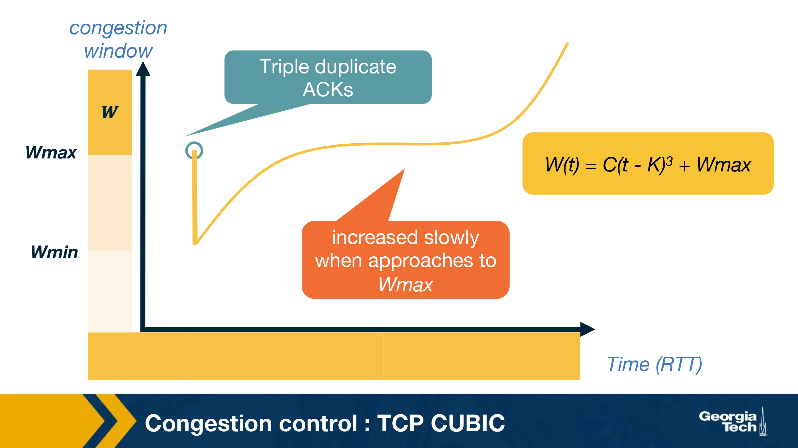

segment - combined message = application message + transport header

transport layers reasons - guarantee delivery, guarantee integrity, multiplexing (separate application)

multiplexing:
- connectionless (only dest port maters) (UDP) (one port - one socket)
- connection oriented (source ip/port and dest port matter) (TCP) (one port - many sockets)

TCP:
1. c->s" 3-way handshake to s welcoming socket
2. c<->s: data connection to connection socket

3-way handshake:
- SYN
- SYNACK
- ACK

TCP guarantees an in-order delivery of the application-layer data without any loss or corruption

Automatic repeat request (ARQ) - resend messages without confirmation after timeout

Go-back-N - send multiple packets, discard out of order, send ack for the most recently received in-order packet.

selective ACKing - acknowledge out of order packets, buffer them.  TCP would need to use a timeout as there is a possibility of ACKs getting lost in the network. In addition to using timeout to detect loss of packets, TCP also uses duplicate acknowledgements as a means to detect loss. A duplicate ACK is additional acknowledgement of a segment for which the sender has already received acknowledgment earlier. When the sender receives 3 duplicate ACKs for a packet, it considers the packet to be lost and will retransmit it instead of waiting for the timeout. This is known as fast retransmit.

TRansmission controls:
- protect receivers buffer from overflowing

On receiver: rwnd = RcvBuffer - [LastByteRcvd - LastByteRead]. Send rwnd with every ACK. 
On sender: UnAcked Data Sent = LastByteSent - LastByteAcked. LastByteSent – LastByteAcked  <= rwnd
Sender continues sending segments of size 1 byte even after when rwnd = 0 (to restart sending when rwnd was 0 and increased later)

Signals of congestion:
- Packet delay
- Packet loss

LastByteSent – LastByteAcked <= min{cwnd, rwnd} 

TCP Reno:

- Additive increase (increase window by 1)
- Multiplicative Decrease (decrease window in half)

slow start phase - increase window exponentially until threshold

TCP Cubic:

