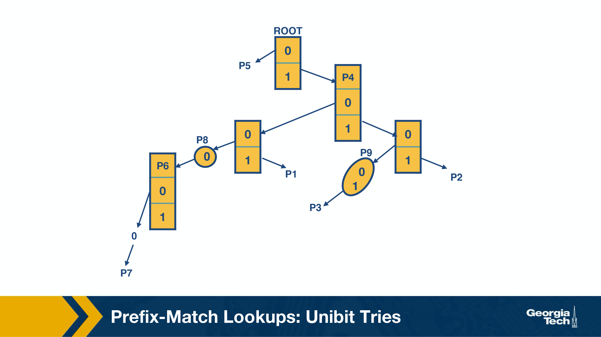
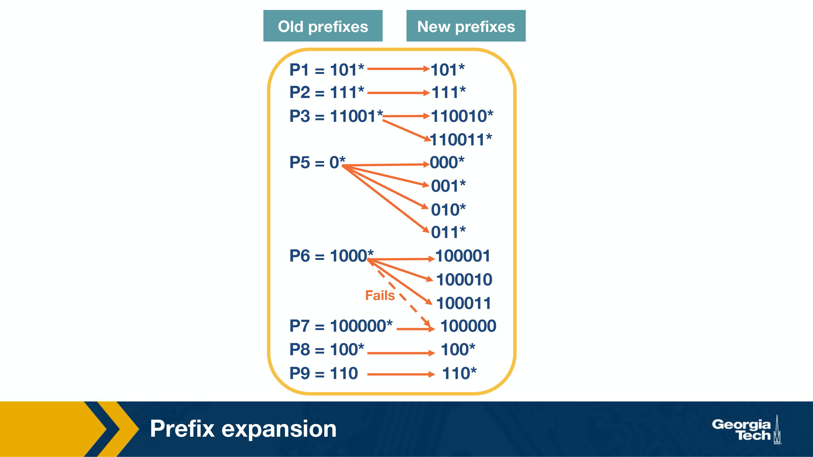

- routing, management (control plane) (software)
- forwarding (data plane) (hardware)

input port -> switch fabric -> output port

input:
line termination -> data link processing -> lookup forwarding, queuing -> switch fabric

output:
switch fabric -> queuing -> data link processing -> line termination

control plane maintains forwarding tables used by data plane.

router functions:

- lookup
- switching
- queuing
- hardware validation and checksum
- route processing
- protocol processing
- fragmentation, redirects and ARP (address resolution)

router protocols:

- SNMP - simple netwokr management - set of counters for remote inspection
- TCP, UDP
- ICMP - internet control message protocol - send error messages when TTL is exceeded

switch fabric:

- memory
- bus
- crossbar (connect N input ports and N output ports with 2N buses)

prefix matching algos:

Variants of packet classification:

- firewalls
- resource reservation protocols
- routing base don traffic type

idea: build a tree based on the compatible dest address. at the leafs we hand trees based on the source address and match them to the rules
problem: memory explosion

idea: build a tree based on the exact dest address. at the leafs we hand trees based on the source address and match them to the rules. find the longest prefix. go up and traverse leafs
problem: increased complexity

idea: prev + add precomuted switch pointers that take use to the next possible source tree

## Scheduling

Take the ticket - each output has a queue on inputs that want to send data. inputs request tickets.
problem: head-of-line (HOL) blocking. the entire queue is blocked by the progress of the head of the queue

idea: knockout scheme - run fabric faster than input
problem: complexity

idea: virtual input queues for every output link

- fifo with tail drop
- bit-by-bit round robin - calc when the packet would have ended transmitting, serve the packet with the minimal end time
- Deficit Round Robin - assign each flow quantum size and deficit size. Serve each round up to quantum + deficit traffic. save leftover as deficit for the next round

Token Bucket - have a counter. increment it via timeout. decrement with each packet. allow packet in only if counter is > 0

policiing - drop packets
shaping - delay packets
