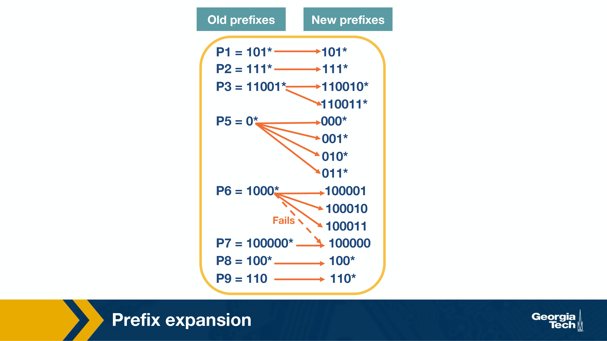

- routing, management (control plane) (software)
- forwarding (data plane) (hardware)

input port -> switch fabric -> output port

input:
line termination -> data link processing -> lookup forwarding, queuing -> switch fabric

output:
switch fabric -> queuing -> data link processing -> line termination

control plane maintains forwarding tables used by data plane.

router functions:

- lookup
- switching
- queuing
- hardware validation and checksum
- route processing
- protocol processing
- fragmentation, redirects and ARP (address resolution)

router protocols:

- SNMP - simple netwokr management - set of counters for remote inspection
- TCP, UDP
- ICMP - internet control message protocol - send error messages when TTL is exceeded

switch fabric:

- memory
- bus
- crossbar (connect N input ports and N output ports with 2N buses)

prefix matching algos:

